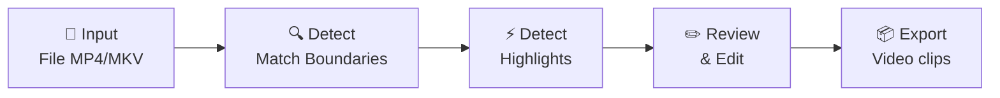

# PUBG Highlight Cutter — Tool cắt highlight từ livestream PUBG

Tool desktop GUI giúp tự động phát hiện và cắt highlight từ file livestream PUBG của tuyển thủ. Highlight được nhóm theo game/match, sắp xếp theo thời gian, hỗ trợ chỉnh sửa thủ công trước khi export.

## Tổng quan flow



**Input:** 1 file video livestream (mp4/mkv) = 1 tuyển thủ, chứa nhiều game.
**Output:** Nhiều video clip highlight, nhóm theo game, sắp xếp theo thời gian. Có thể export riêng lẻ hoặc gộp mỗi game thành 1 video.

---

## Tech Stack

> [!IMPORTANT]
> **Đề xuất: Python + PyQt6 + OpenCV + FFmpeg**
>
> Lý do:
> - Python: hệ sinh thái ML/CV mạnh nhất cho detect highlight
> - PyQt6: GUI đẹp, native-feel, video player tích hợp
> - OpenCV: xử lý frame, template matching cho game UI detection
> - FFmpeg (subprocess): cắt/ghép video nhanh, không cần re-encode

---

## Proposed Changes

### 1. Core Engine — Detect Match Boundaries

#### [NEW] [match_detector.py](file:///c:/Users/PhanAnh/Desktop/nghịch%20vớ%20vẩn/tool_cat_highlight_yt/core/match_detector.py)

Phát hiện ranh giới giữa các game trong 1 file livestream bằng cách nhận diện game UI:

- **Template matching** với OpenCV: detect lobby screen, loading screen, "Winner Winner Chicken Dinner" / death screen
- Sample frames mỗi 2-5 giây (không cần mỗi frame, tiết kiệm CPU)
- Output: list `Match(start_time, end_time, match_index)`
- Kèm thư mục `templates/` chứa ảnh mẫu các màn hình lobby/loading/winner (người dùng có thể thêm template riêng)

**Thuật toán:**
1. Duyệt frame theo interval (mỗi 2s)
2. Với mỗi frame: chạy template matching cho từng template (lobby, loading, death, winner)
3. Nếu match score > threshold → đánh dấu transition point
4. Gộp các transition points liên tiếp thành match boundaries
5. Trả về danh sách match với start/end timestamp

---

### 2. Core Engine — Detect Highlights

#### [NEW] [highlight_detector.py](file:///c:/Users/PhanAnh/Desktop/nghịch%20vớ%20vẩn/tool_cat_highlight_yt/core/highlight_detector.py)

Phát hiện khoảnh khắc highlight trong mỗi match. Kết hợp nhiều tín hiệu:

- **Audio spike detection:** dùng `librosa` hoặc raw waveform — detect đỉnh âm lượng (tiếng súng, hét, reaction)
- **Kill feed detection (OCR):** dùng `pytesseract` hoặc `easyocr` đọc kill feed ở góc phải trên — nếu tên tuyển thủ xuất hiện = highlight
- **Rapid scene change:** tính frame difference — đột biến = action đang diễn ra
- **Score fusion:** mỗi tín hiệu cho 1 score, tổng hợp lại → vượt threshold = highlight segment

**Output:** list `Highlight(start_time, end_time, confidence, type, match_index)`

Mỗi highlight mặc định pad thêm 3s trước và 2s sau (configurable).

---

### 3. Core Engine — Video Processor

#### [NEW] [video_processor.py](file:///c:/Users/PhanAnh/Desktop/nghịch%20vớ%20vẩn/tool_cat_highlight_yt/core/video_processor.py)

Cắt và ghép video bằng FFmpeg subprocess:

- `cut_clip(source, start, end, output)` — cắt 1 clip, stream copy (không re-encode, nhanh)
- `merge_clips(clips[], output)` — ghép nhiều clip thành 1 video (dùng concat demuxer)
- `export_group(highlights[], source, output_dir)` — export 1 nhóm game: cả riêng lẻ + gộp

---

### 4. Data Model

#### [NEW] [models.py](file:///c:/Users/PhanAnh/Desktop/nghịch%20vớ%20vẩn/tool_cat_highlight_yt/core/models.py)

Dataclasses đơn giản:

```python
@dataclass
class Match:
    index: int
    start_time: float  # seconds
    end_time: float
    label: str  # "Game 1", "Game 2"...

@dataclass
class Highlight:
    start_time: float
    end_time: float
    confidence: float
    highlight_type: str  # "kill", "audio_spike", "scene_change"
    match_index: int
    label: str  # user-editable

@dataclass
class Project:
    source_file: str
    matches: list[Match]
    highlights: list[Highlight]
```

---

### 5. GUI — Main Window

#### [NEW] [gui/main_window.py](file:///c:/Users/PhanAnh/Desktop/nghịch%20vớ%20vẩn/tool_cat_highlight_yt/gui/main_window.py)

Layout chính:

```
┌─────────────────────────────────────────────────┐
│  Menu Bar: File | Settings | Help               │
├──────────────────────┬──────────────────────────┤
│                      │  📋 Highlight List        │
│   🎥 Video Player    │  ┌──────────────────────┐│
│                      │  │ Game 1               ││
│   [seek bar]         │  │  ├─ Kill 00:15:32    ││
│   ▶ ⏸ ⏪ ⏩          │  │  ├─ Action 00:18:45  ││
│                      │  │  └─ Kill 00:22:10    ││
│                      │  │ Game 2               ││
│                      │  │  ├─ Kill 00:45:01    ││
│                      │  │  └─ Action 00:48:33  ││
├──────────────────────┤  └──────────────────────┘│
│  🔍 Timeline         │  [+ Add] [✏ Edit] [🗑 Del]│
│  |===█==█=====█===|  │  [📦 Export Selected]    │
│  highlights markers  │  [📦 Export All]          │
└──────────────────────┴──────────────────────────┘
```

**Tính năng:**
- Video player: phát video, seek, play/pause (dùng QMediaPlayer hoặc mpv embedded)
- Timeline bar: hiển thị toàn bộ video, đánh dấu vị trí highlight bằng markers màu
- Highlight list: tree view nhóm theo game, click để nhảy đến timestamp
- CRUD: thêm, sửa, xóa highlight thủ công, kéo chỉnh start/end time
- Export: chọn highlight → export riêng hoặc gộp theo game

---

### 6. GUI — Timeline Widget

#### [NEW] [gui/timeline_widget.py](file:///c:/Users/PhanAnh/Desktop/nghịch%20vớ%20vẩn/tool_cat_highlight_yt/gui/timeline_widget.py)

Custom QWidget vẽ timeline:

- Background: match boundaries (mỗi game 1 màu khác nhau)
- Markers: highlight points (click = nhảy đến vị trí)
- Draggable handles: kéo chỉnh start/end highlight
- Current position indicator

---

### 7. GUI — Settings & Config

#### [NEW] [config.py](file:///c:/Users/PhanAnh/Desktop/nghịch%20vớ%20vẩn/tool_cat_highlight_yt/config.py)

File config đơn giản (JSON hoặc TOML):

```python
DEFAULT_CONFIG = {
    "frame_sample_interval": 2.0,      # seconds giữa mỗi lần sample frame
    "audio_spike_threshold": 0.8,       # 0-1, ngưỡng detect audio spike
    "template_match_threshold": 0.75,   # ngưỡng OpenCV template matching
    "highlight_pad_before": 3.0,        # seconds pad trước highlight
    "highlight_pad_after": 2.0,         # seconds pad sau highlight
    "export_format": "mp4",
    "ffmpeg_path": "ffmpeg",            # path đến ffmpeg binary
}
```

---

### 8. Entry Point

#### [NEW] [main.py](file:///c:/Users/PhanAnh/Desktop/nghịch%20vớ%20vẩn/tool_cat_highlight_yt/main.py)

Entry point khởi chạy app PyQt6.

#### [NEW] [requirements.txt](file:///c:/Users/PhanAnh/Desktop/nghịch%20vớ%20vẩn/tool_cat_highlight_yt/requirements.txt)

```
PyQt6
opencv-python
numpy
librosa
easyocr
```

---

## Cấu trúc thư mục

```
tool_cat_highlight_yt/
├── main.py                 # Entry point
├── config.py               # Settings & defaults
├── requirements.txt
├── templates/              # Ảnh mẫu game UI (lobby, loading, winner...)
│   ├── lobby.png
│   ├── loading.png
│   └── winner.png
├── core/
│   ├── __init__.py
│   ├── models.py           # Dataclasses
│   ├── match_detector.py   # Detect ranh giới game
│   ├── highlight_detector.py  # Detect highlight
│   └── video_processor.py  # Cắt/ghép video
└── gui/
    ├── __init__.py
    ├── main_window.py      # Main GUI window
    └── timeline_widget.py  # Timeline custom widget
```

---

## User Review Required

> [!IMPORTANT]
> **Template matching cần ảnh mẫu thật.** Bạn cần cung cấp screenshot của:
> - Màn hình lobby PUBG
> - Màn hình loading
> - Màn hình "Winner Winner Chicken Dinner" / death screen
>
> Không có ảnh mẫu → detect match boundary sẽ không hoạt động.

> [!WARNING]
> **OCR kill feed** phụ thuộc nhiều vào resolution và font PUBG. Nếu OCR không chính xác, cần fallback về phương pháp khác (audio + scene change). Có thể cần fine-tune hoặc dùng template matching cho kill feed thay vì OCR.

> [!IMPORTANT]
> **FFmpeg cần cài sẵn** trên máy. Tool sẽ gọi FFmpeg qua subprocess.

## Open Questions

> [!IMPORTANT]
> 1. **Tên tuyển thủ**: Tool cần biết tên in-game của tuyển thủ để detect kill feed. Bạn muốn nhập thủ công hay có cách khác?
> 2. **Resolution video**: Livestream thường ở resolution nào? (1080p, 1440p, 4K?) Ảnh hưởng đến vị trí crop kill feed.
> 3. **Ngôn ngữ PUBG**: Tiếng Anh hay tiếng Việt? Ảnh hưởng đến OCR và template.

---

## Verification Plan

### Automated Tests
```bash
pytest tests/ -v
```

- Unit test cho `match_detector`: cho ảnh mẫu → kiểm tra detect đúng
- Unit test cho `highlight_detector`: cho audio/video segment → kiểm tra output
- Unit test cho `video_processor`: kiểm tra FFmpeg command generation

### Manual Verification
- Chạy tool với 1 file livestream PUBG thật
- Kiểm tra match boundaries có chính xác không
- Kiểm tra highlights detect có đúng khoảnh khắc hay không
- Thử chỉnh sửa thủ công (thêm/xóa/sửa highlight)
- Export và kiểm tra video output
